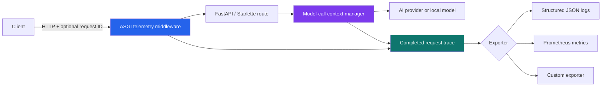
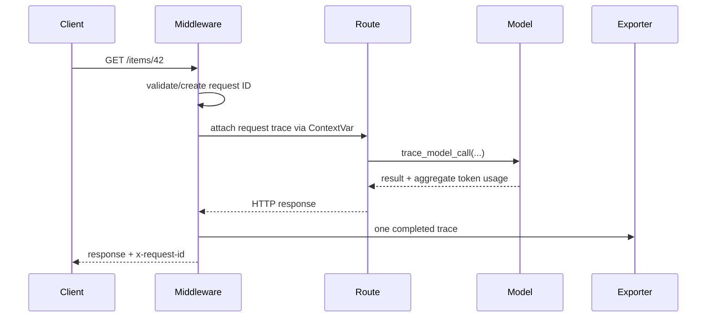

# FastAPI AI Telemetry

Privacy-safe request and model-call observability for FastAPI and Starlette services.

The package connects an HTTP request to the AI calls it triggers, then exports one structured trace to logs, tests, or Prometheus. It records operational signals—latency, status, token counts, provider, and model—without accepting prompt or response bodies.

## Why this exists

AI endpoints cross two reliability boundaries: the web application and an external or self-hosted model. Standard HTTP metrics explain that a request was slow; they do not explain which model call was slow, how many tokens it used, or whether the model failed. This middleware joins those signals under one request ID while keeping sensitive content out of the telemetry API.

## Architecture



### Request lifecycle



## Design guarantees

- **Content stays out:** prompt, response, and request bodies are not accepted by the instrumentation API.
- **Headers are opt-in:** no request header is captured unless explicitly allowlisted.
- **Secrets remain redacted:** authorization, cookies, API keys, and set-cookie values are redacted even when allowlisted.
- **Bounded metric labels:** paths are reported using route templates such as `/items/{item_id}`, avoiding a label per resource ID.
- **Failure isolation:** an unavailable telemetry exporter is logged but does not break the application response.
- **Framework-safe context:** `ContextVar` keeps concurrent request traces isolated without passing state through every function.

## Quick start

Install from source:

```bash
git clone https://github.com/shrutilekkala/fastapi-ai-telemetry.git
cd fastapi-ai-telemetry
python -m venv .venv
source .venv/bin/activate  # Windows: .venv\Scripts\activate
pip install -e ".[example]"
```

Instrument an application:

```python
from fastapi import FastAPI

from fastapi_ai_telemetry import (
    AITelemetryMiddleware,
    JsonLogExporter,
    trace_model_call,
)

app = FastAPI()
app.add_middleware(
    AITelemetryMiddleware,
    exporter=JsonLogExporter(),
    service_name="recommendation-api",
    header_allowlist=("x-tenant",),
)


@app.post("/recommend")
def recommend() -> dict[str, str]:
    with trace_model_call(
        "openai",
        "example-model",
        metadata={"operation": "recommend"},
    ) as call:
        # Invoke the model here. Only aggregate usage is recorded.
        call.set_usage(input_tokens=120, output_tokens=28)
    return {"recommendation": "example"}
```

### Prometheus

Use the optional exporter with a custom registry or the default registry:

```python
from fastapi_ai_telemetry import CompositeExporter, JsonLogExporter, PrometheusExporter

exporter = CompositeExporter([JsonLogExporter(), PrometheusExporter()])
```

It exposes counters and histograms for HTTP requests, route latency, model calls, model latency, and input/output tokens. The application remains responsible for exposing the Prometheus registry on its chosen `/metrics` endpoint.

## Trace shape

```json
{
  "request_id": "trace-123",
  "service": "recommendation-api",
  "method": "POST",
  "path": "/recommend",
  "route": "/recommend",
  "status_code": 200,
  "duration_ms": 42.3,
  "request_headers": {"x-tenant": "north"},
  "input_tokens": 120,
  "output_tokens": 28,
  "model_calls": [
    {
      "provider": "openai",
      "model": "example-model",
      "duration_ms": 38.1,
      "input_tokens": 120,
      "output_tokens": 28,
      "success": true,
      "error_type": null,
      "metadata": {"operation": "recommend"}
    }
  ]
}
```

## Development

```bash
pip install -e ".[test]"
ruff check .
pytest -q
```

Run the example service:

```bash
uvicorn examples.app:app --reload
curl -X POST http://localhost:8000/summarize \
  -H "content-type: application/json" \
  -H "x-tenant: demo" \
  -d '{"text":"Observability should explain failures without collecting user content."}'
curl http://localhost:8000/metrics
```

Or use Docker:

```bash
docker build -t fastapi-ai-telemetry .
docker run --rm -p 8000:8000 fastapi-ai-telemetry
```

## Scope and tradeoffs

This repository intentionally provides lightweight application instrumentation rather than a full tracing backend. It does not persist traces, sample traffic, calculate model cost, or instrument vendor SDKs automatically. Exporters can be added behind the small `TraceExporter` protocol; production deployments should route JSON logs or Prometheus metrics to their existing observability stack.

## Roadmap

- OpenTelemetry span exporter
- Async model-call context manager
- Configurable sampling and latency exemplars
- Provider adapters that normalize usage metadata without collecting content

## License

MIT
